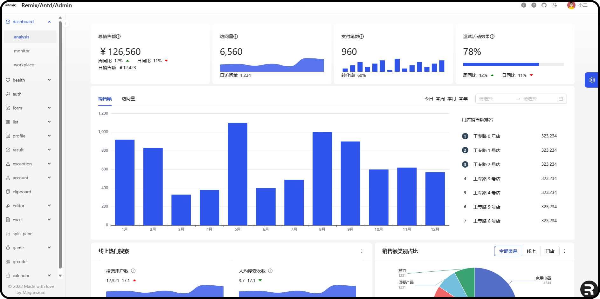

<p align="center">
  
  
  
  
  
</p>

## Remix Antd Admin

A lightweight content management system, not limited to content management.

> https://remix-antd-admin.vercel.app

## Stack

- 🌟 [Remix](https://remix.run/docs/en/main)main framework
- ⚡️ [Vite](https://vitejs.dev/guide/#scaffolding-your-first-vite-project)Developing and building applications with Vite is exceptionally fast.
- 🏰 [Ant Design design](https://ant.design/)system and [ProComponent](https://procomponents.ant.design/en-US/docs)
- 🚀 [RxJS](https://rxjs.dev/guide/overview)has significant advantages in handling complex calculations
- 📊 [Echarts](https://echartsjs.com/index.html) system and SSR (Server-Side Rendering)
- 🌍 [i18n](https://www.i18next.com/) Internationalization support with i18next, react-i18next, and remix-i18next
- 🌈 [TailwindCSS](https://tailwindcss.com/docs/installation) Atomic support with Tailwind CSS and CSS-IN-JS and so on
- 🧰 [RemixDevTool](https://remix-development-tools.fly.dev/) Developer tools support with remix-development-tools
- 🃏 [Prisma](https://www.prisma.io/docs/getting-started) ORM support (SQLite、MySQL、MongoDB)
- ✅ [Zod](https://zod.dev/) TypeScript-first schema validation with static type inference
- 🧪 [Vitest](https://vitest.dev/) Component testing with Vitest
- 🐸 [Cypress](https://docs.cypress.io/) e2e testing with Cypress
- 🎯 [Remix RESTful](https://remix.run/docs/en/main/guides/bff) RESTful API with swagger
- 🍭 [GraphQL](https://graphql.org/) api support
- 🐳 [Docker](https://www.docker.com/) docker quick to deploy

## Quickstart

```sh
git clone https://github.com/yyong008/remix-antd-admin.git
# or
git clone https://gitee.com/yyong008/remix-antd-admin.git

pnpm install # install deps

pnpm run dev # pnpm dev

pnpm run build #pnpm build
# 💌💌💌It is preferable to choose machines with more than 2GB of memory for packaging, with a recommendation of 4GB.

pnpm run start # pnpm start # PORT=3003 pnpm run start
```

## Client only

```tsx
<html lang={params.lang}>
  <body>
    <ClientOnly fallback={<Loading />}>{() => <Outlet />}</ClientOnly>
  </body>
</html>
```

## Code layout

- `/app/routes/**` define all routes and apis
- `/app/components/**` define components
- `/app/hooks/**` define custom hooks
- `/app/layout/**` define main layout
- `/app/services/**` define mock service get data
- `/app/config/**` define app config
- `/app/styles/**` define styles hooks
- `/app/i18n/**` define i18n config
- `/app/utils/**` define utils function
- `/app/db/**` define mock database
- `/app/__test__/**` define test demos
- `.env.tpl` define env template

## @ant-design/icons uages

use in client only mode

```ts
import * as _icons from "@ant-design/icons";

const { MoreOutlined } = _icons;
```

## API checkhealth

```ts
export const loader: LoaderFunction = () => {
  return new Response("Alive", { status: 200 });
};
```

visit: `http://localhost:<your_port>/checkhealth`, if get `Alive`, this api server is alive。

## deploy

- normal
- vercel (vite)
- docker

## Prisma

>tips: when download Prisma engine,  no proxy。

## License

[MIT](./LICENSE)

## Support

[buy-me-a-coffee](https://github.com/yyong008/buy-me-a-coffee) If you think this project has helped you, please invite the author to have a cup of coffee, thank you for your support .
